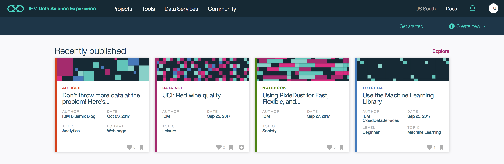

# Lab - Visualize public health violation data in the Data Science Experience

© Copyright IBM Corporation 2017

IBM, the IBM logo and ibm.com are trademarks of International Business Machines Corp., registered in many jurisdictions worldwide. Other product and service names might be trademarks of IBM or other companies. A current list of IBM trademarks is available on the Web at &quot;Copyright and trademark information&quot; at www.ibm.com/legal/copytrade.shtml.

This document is current as of the initial date of publication and may be changed by IBM at any time.

The information contained in these materials is provided for informational purposes only, and is provided AS IS without warranty of any kind, express or implied. IBM shall not be responsible for any damages arising out of the use of, or otherwise related to, these materials. Nothing contained in these materials is intended to, nor shall have the effect of, creating any warranties or representations from IBM or its suppliers or licensors, or altering the terms and conditions of the applicable license agreement governing the use of IBM software. References in these materials to IBM products, programs, or services do not imply that they will be available in all countries in which IBM operates. This information is based on current IBM product plans and strategy, which are subject to change by IBM without notice. Product release dates and/or capabilities referenced in these materials may change at any time at IBM&#39;s sole discretion based on market opportunities or other factors, and are not intended to be a commitment to future product or feature availability in any way.

# Overview

This Lab will be performed on IBM Data Science Experience platform (datascience.ibm.com). This Lab will guide you to load, analyze and visualize public health violation data to uncover interesting insights about New York Restaurants using Apache Spark, Python and Jupyter.

IBM Data Science Experience (DSX) is the premier offering that seamlessly allows data scientists and data engineers to connect data from multiple domains, to analyze and visually explore the data for insights. DSX brings together the data science development experience accumulated in R, Python, Scala, and Java, intuitive data connectivity and processing capabilities of Apache Spark, and the state-of-art dynamic visualization technology using Brunel, Pixiedust, and RStudio.

## Prerequisites

* Bluemix supported [web browser](https://console.ng.bluemix.net/docs/overview/prereqs.html#prereqs)

## Before you begin
To be able do this lab a Bluemix account is necessary. If you don't have one yet -- or you did not complete the initial set up of your Bluemix account -- follow the steps below.

### Already registered and completed set-up

When you already registered and completed the initial set-up of your Bluemix account, you directly jump to [Create a space in Bluemix US region](#create-a-space-in-bluemix-us-region).

### Not registered

Use Ctrl-click (or the equivalent action for your system) to open the [Sign Up for Bluemix](https://console.bluemix.net/registration/trial) page in a separate tab. Fill in the form and click **Start your FREE Bluemix trial** to complete the registration. You will receive an activation mail in your inbox.

### First time login

Use Ctrl-click (or the equivalent action for your system) to open the [Login to Bluemix](https://console.bluemix.net/login) in a separate tab. First time users need to complete a 4-step wizard. This starts by accepting the terms & conditions.

  

Define a name for your organization.

  

Choose a name for your space. Typically `dev` would be a good name for your first space.

  

On the last page, click **I'm Ready** to complete the set up process.

### Create a space in Bluemix US region

For the remainder of this lab we switch to the **US region** of Bluemix. For this, use Ctrl-click (or the equivalent for your system) to open the Bluemix dashboard. Click your account and choose **US South** as your active region.

If you are all OK, you get the dashboard. Otherwise, you will be asked to create your first space in this region -- as depicted in the screenshot below. Typically `dev` would be a good name for your space.

Congrats, you're now ready to start your data science experience :smiley:!!

# Step 1: Sign up for IBM Data Science Experience

IBM Data Science Experience is an interactive, collaborative, cloud-based environment where data scientists can use multiple tools to activate their insights. In this part of the lab you will sign up for a 30-day trial of IBM Data Science Experience.

  1.  In a web browser navigate to [https://datascience.ibm.com](https://datascience.ibm.com).

  2.  Click on **Sign Up** at the top right.

  

  3. Click on **Sign in with your IBM id** and enter your Bluemix credentials.

  

  4. Follow the instructions to complete the sign up for IBM Data Science Experience. Note that two Bluemix services will be created for you -- a Cloud Object Storage service and an Apache Spark service. As soon as the 'Get Started' button is clickable, click it and you should be directed to the Data Science Experience dashboard as shown below.

  
  

# Step 2. Watch the Video of this Hands on Exercise.

Click on Image to watch YouTube Video. https://www.youtube.com/watch?v=2Ub8lf4upag

 > 

# Step 3. Load your notbook into Data Science Experience (DSX).

1. Click Start a New Notebook.

2. Click From Url, Enter any Notebook Name and Description and  paste notebook URL https://github.com/justinmccoy/visualize-health-violation-data-DSX/blob/master/New%20York%20Restaurants.ipynb

3. Select Create Notebook

# Step 4. Execute the steps in your notebook.

Run code cells in your notebook. Note: Read instructions. Some cells require you to enter the code. 

*Interface Hint: 
Jupyter notebooks are cell driving with commands buttons along the top. 
Just hit play button to run code in an active cell.
